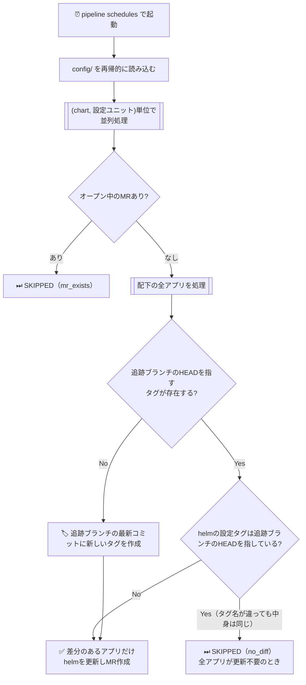

<p align="center">
  
</p>

<h1 align="center">helm-yadokari</h1>

<p align="center">
  ヤドカリが定期的に新しい殻へ引っ越すように、Helm chart が参照するアプリケーションの<br>
  バージョン（イメージタグ）を GitLab のタグから自動判定し、必要なときだけ更新の Merge Request を作成します。
</p>

<p align="center">
  
  
  
  
  
</p>

---

複数チーム・複数アプリを Helm chart で運用していると、アプリの新バージョンが出るたびに
`values.yaml` のイメージタグを手で書き換えて MR を作るのが手間になりがちです。
**helm-yadokari** は GitLab CI の pipeline schedules から定期実行することで、
chart リポジトリ単位に更新をまとめた MR 作成を自動化します。

要件・設計の詳細は [`docs/requirements.md`](./docs/requirements.md) を参照してください。

## 目次

- [Features](#features)
- [タグ形式](#タグ形式)
  - [タグの自動作成](#タグの自動作成)
- [Quick Start](#quick-start)
- [仕組み](#仕組み)
  - [実行ログの例](#実行ログの例)
- [設定](#設定)
  - [環境変数](#環境変数)
  - [config/](#config)
  - [設定ファイルの検証](#設定ファイルの検証)
- [エラーハンドリング](#エラーハンドリング)
- [CI/CD](#cicd)
  - [セットアップ手順](#セットアップ手順)
  - [手動実行時のオプション（Pipeline inputs）](#手動実行時のオプションpipeline-inputs)
- [開発](#開発)
  - [プロジェクト構成](#プロジェクト構成)
- [License](#license)

## Features

- **複数チーム・複数chart・複数GitLabプロジェクトに対応** — `config/` 配下にディレクトリで登録
- **設定ユニット単位でMRを1つに集約** — 同じ設定ユニット内の複数アプリの更新をまとめて1MR（1つのchartリポジトリに複数の設定ユニットがあれば、それぞれ独立したMRになる）
- **オールオアナッシングな更新** — 設定ユニット内の1アプリでも処理に失敗したら、その更新を見送り次回に再試行（他の設定ユニットには影響しない）
- **タグ自動作成** — 追跡ブランチのHEADコミットを指すタグが1件も無い場合は、最新コミットにタグ形式通りの新しいタグを作成してから更新する
- **追跡ブランチの切り替えを検知** — `branchToSync` を変更したら、変更後のブランチのHEADを指すタグを反映する（変更前後のブランチが同じコミットを指していても更新する）
- **重複作成を防ぐチェック** — 未マージMRがある間は、その設定ユニットの更新をスキップ
- **並列実行による高速処理** — `CONCURRENCY_LIMIT`（`p-limit`）で同時処理数を制御
- **パイプラインへの導線** — MR本文にタグへのリンクと、そのタグに紐づく最新パイプラインのURLを記載（状態は表示せずリンクのみ。マージ判断はレビュアーに委ねる）
- **差分をワンクリックで確認** — MR本文に旧タグ→新タグ間のGitLab比較URLを記載
- **ドライランモード** — `DRY_RUN=true` でタグ作成・ブランチ作成・MR作成をスキップし、更新予定の内容だけログ出力
- **設定バリデーション** — 起動時に Zod でスキーマを検証し、設定ミスを早期に検出

## タグ形式

GitLab のタグのうち、追跡ブランチの現在のHEADコミットを指しているものから最新タグを決めます。
タグ形式はアプリ（ソースリポジトリ）単位に `registry.yaml` の `appSpecs[].tagFormat` で指定します
（**必須**。既定値はありません）。

`{branch}`（追跡ブランチ名の "/" を "-" に置換した値）・`{date}`（`yyyymmdd`）・
`{time}`（`hhmmss`）の3つを**ちょうど1回ずつ**含める必要があり、**並び順と区切り文字は自由**です
（例: `{branch}-build-at-{date}-{time}`、`{date}-{time}-{branch}`、`v{time}_{branch}__{date}`）。
3つのうちどれかが欠けているテンプレートは設定エラーになります。

`{date}`/`{time}` はJST（UTC+9固定、設定不可）で組み立て・解釈します。

例: `{branch}-build-at-{date}-{time}` で追跡ブランチが `release/foo` の場合
→ `release-foo-build-at-20260902-123456`

```yaml
# registry.yaml
appSpecs:
  - projectId: 2
    projectName: my-app
    tagFormat: "{branch}-build-at-{date}-{time}"
```

### タグの自動作成

追跡ブランチのHEADを指すタグが1件も無いとき、このツール自身が追跡ブランチの最新コミットへ
タグを作成します。`{time}` が必須なので、生成するタグ名は秒単位で一意になります。

タグ形式の仕様の正典は [`docs/requirements.md`](./docs/requirements.md) の
「4.1 バージョン判定」・「4.4 アプリの登録・設定」です（運用途中で変更した場合の挙動もそちら）。

## Quick Start

**前提条件**

- Node.js 22.x 以上
- pnpm 11.x 以上
- GitLab Group/Project Access Token（スコープ: `read_api` + `write_repository` + MR作成権限。最小権限で発行してください）

```bash
# 1. インストール
git clone https://github.com/sinnlosses/helm-yadokari.git
cd helm-yadokari
pnpm install

# 2. .env を作成（GITLAB_URL / ACCESS_TOKEN を書き込む。他のキーは .env.example 参照）
cp .env.example .env
# → GITLAB_URL / ACCESS_TOKEN を編集する（未設定だと `pnpm dev` が起動前に落ちる）

# 3. 設定ファイルを作成（config/ 配下の構成は下記「設定」を参照）
mkdir -p config/my-team-chart/my-unit   # 深さ2も可（例: config/my-team-chart/my-group/my-unit）
# → registry.yaml / config.yaml を作成する（最小サンプルは下記「config/」参照。
#   完全な記述例は docs/requirements.md 4.4節）
# 同梱の config/yadokari-smoke-test-chart* は作者の検証用configなので、
# 消すか TARGET_CHART=my-team-chart のように絞り込みを指定してから実行する
# （絞り込み無しだと第三者の環境では必ず ERROR になる）

# 4. 動作確認（ブランチ作成・MR作成なし・安全）
DRY_RUN=true TARGET_CHART=my-team-chart pnpm dev

# 5. 実行
TARGET_CHART=my-team-chart pnpm dev
```

環境変数はどれも、`.env` に書く代わりに上の手順4・5のようにコマンド行頭で渡せます
（両方にある場合はコマンド行頭の値が優先されます）。

## 仕組み

`config/` に定義された `(chartリポジトリ, 設定ユニット)` の組ごとに、配下の
全アプリを処理し、以下の条件をすべて満たす場合のみその単位で1つの MR を作成します。
1つの chart リポジトリに複数の設定ユニットがあれば、同じプロジェクトに対して
それぞれ独立したブランチ・MR が作られます。



同じ設定ユニット内で一部アプリの処理が失敗した場合、成功した分だけを反映することは
せず、その設定ユニットの更新全体を `ERROR` として次回実行に持ち越します
（オールオアナッシング）。同じ chart リポジトリ内の他の設定ユニットには影響しません。

### 実行ログの例

```json
{"level":"info","timestamp":"2026-09-02T00:00:00.000Z","event":"run_start","gitlabUrl":"https://gitlab.example.com","dryRun":false,"concurrencyLimit":3,"configRootPath":"config"}
{"level":"info","timestamp":"2026-09-02T00:00:00.123Z","event":"update_unit","chartDirName":"teamA-chart","unitPath":"my-group/my-unit","chartProjectId":888,"chartProjectName":"teamA-chart","result":"CREATED","apps":[{"projectName":"my-app","latestTag":"main-build-at-20260902-090000","updates":[{"valuesPath":"charts/my-app/values.yaml","currentTag":"main-build-at-20260901-090000"}]}],"helmBranchRefUpdates":[]}
{"level":"info","timestamp":"2026-09-02T00:00:00.456Z","event":"update_unit","chartDirName":"teamB-chart","unitPath":"my-unit","chartProjectId":999,"chartProjectName":"teamB-chart","result":"SKIPPED","reason":"no_diff"}
{"level":"info","timestamp":"2026-09-02T00:00:00.500Z","event":"summary","CREATED":1,"SKIPPED":1,"ERROR":0}
{"level":"info","timestamp":"2026-09-02T00:00:00.520Z","event":"run_end","durationMs":520}
```

上は絞り込み無しの実行例です。`TARGET_CHART` / `TARGET_UNITS` を指定すると、`run_start` に `targetChart` / `targetUnits` が載ります。

## 設定

### 環境変数

| 変数名              | 必須 | デフォルト | 説明                                                                                                                                                                                                                                   |
| ------------------- | :--: | ---------- | -------------------------------------------------------------------------------------------------------------------------------------------------------------------------------------------------------------------------------------- |
| `GITLAB_URL`        |  ✓   | —          | GitLab インスタンスの URL（`http://` または `https://` で始まる形式）                                                                                                                                                                  |
| `ACCESS_TOKEN`      |  ✓   | —          | `read_api` + `write_repository` + MR作成権限を持つ Group/Project Access Token（最小権限で発行してください）                                                                                                                            |
| `CONFIG_ROOT_PATH`  |      | `config`   | 設定ディレクトリの最上位のパス（作業ディレクトリ外を指すパスは拒否され、実在しないディレクトリを指定した場合もエラー終了します）                                                                                                       |
| `CONCURRENCY_LIMIT` |      | `3`        | `(chartリポジトリ, 設定ユニット)`単位の同時処理数（1〜20の整数）                                                                                                                                                                       |
| `DRY_RUN`           |      | `false`    | `"true"` のときタグ作成・ブランチ作成・MR作成をスキップし、更新予定の内容のみログ出力します                                                                                                                                            |
| `TARGET_CHART`      |      | —          | 指定すると `config/` 配下の特定のchartディレクトリのみ処理対象にします（省略時は全chart）。存在しないディレクトリ名を指定した場合、または絞り込み結果が0件の場合はエラー終了します                                                     |
| `TARGET_UNITS`      |      | —          | 指定すると特定の設定ユニットのみ処理対象にします。`unitPath`（`config/<chartディレクトリ>/` からの深さ1〜2の相対パス）を、カンマ区切りで複数指定可（省略時は全設定ユニット）。該当する設定ユニットが見つからない場合はエラー終了します |

### config/

対象アプリを chart リポジトリ・設定ユニット単位のディレクトリ構成で定義します。

```
config/
  <chartリポジトリ名>/            # 例: teamA-chart（ディレクトリ名は人間向けのラベル）
    registry.yaml                  # chartリポジトリの情報＋ソースリポジトリのタグ形式の台帳
    <ユニット名>/                  # 設定ユニット（深さ1）
      config.yaml                  # 運用値（どのプロジェクトのどのブランチを追跡するか）＋
                                    # chart構造（values.yaml内のどこに書き込むか）
    <第1セグメント>/               # 設定ユニット（深さ2）
      <第2セグメント>/
        config.yaml
```

ファイルを分ける軸は「スコープ」です。`registry.yaml` はchartリポジトリ単位で、MRの作成先
（`chartToUpdate`）と、ソースリポジトリのタグ形式（`appSpecs[].tagFormat`。詳細は
「[タグ形式](#タグ形式)」参照）の台帳を持ちます。`config.yaml` は設定ユニット単位で、
どのプロジェクトのどのブランチを追跡し `values.yaml` のどこ（`valuesPath` + YAMLアンカー名）に
書き込むかを持ちます。両者は `projectId` で対応付けます。

Helmの向き先ブランチとは、values.yaml のパラメータを受け取ってk8sリソースを実際に構築する
ブランチのことです。`mrTargetBranch`（値定義ブランチ。MRの作成先）とは別物で、このブランチへの
追従・更新もMRの対象に含まれます。chartリポジトリはこの2ブランチ構成であることが前提のため、
`config.yaml` の `helm` は**必須**です。

更新したくない設定ユニットは、現在の値と同じブランチ名を書けば差分が出ないので更新されません。

`config.yaml` を1つ持つディレクトリが1つの設定ユニット（MRを作る単位）です。chartリポジトリの
ディレクトリからそこまでの相対パスが `unitPath` になり、固定ブランチ名
`feature/yadokari/<unitPath>` にもそのまま入ります。階層は**深さ1〜2**で、同じchartリポジトリの
配下に深さ1と深さ2を混在させられます（テナント分けが不要ならダミーの階層を作らず深さ1で
構いません）。設定ユニットの入れ子（`config.yaml` を持つディレクトリの配下にさらに
`config.yaml` があること）と、深さ0（`registry.yaml` と同じ階層）・深さ3以上はいずれも
設定エラーになります。

各ファイルの記述例・フィールドの完全な仕様・制約（`config.yaml`/`registry.yaml` 間の対応チェック、
重複禁止など、設定ミスは実行前に例外で停止します）は [`docs/requirements.md`](./docs/requirements.md)
の「4.4 アプリの登録・設定」が正典です（`config/yadokari-smoke-test-chart/` にも実物の記述例があります）。

最小構成の例（必須フィールドのみ）:

```yaml
# registry.yaml
chartToUpdate:
  projectId: 100
  projectName: my-team-chart
  mrTargetBranch: main # 値定義ブランチ（MRの作成先）
appSpecs:
  - projectId: 2
    projectName: my-app
    tagFormat: "{branch}-build-at-{date}-{time}"
```

```yaml
# config.yaml
helm: # Helmの向き先ブランチ（values.yamlを受け取ってk8sリソースを構築するブランチ）の設定。必須
  branchRef: helm-main
  locations:
    - valuesPath: charts/my-app/values.yaml
      anchor: my-app-tag
apps:
  - projectId: 2 # registry.yaml の appSpecs[].projectId と対応させる
    projectName: my-app
    branchToSync: main # このアプリの追跡ブランチ
    locations:
      - valuesPath: charts/my-app/values.yaml
        anchor: my-app-tag
```

### 設定ファイルの検証

```bash
# 文法・整合性のチェック（GitLabへの接続不要。pnpm check にも含まれる）
pnpm lint:validate-config

# 上記に加えて、projectId・ブランチ・valuesPath・アンカーが GitLab 上に実在するかを検証
# （読み取りのみ。タグ・ブランチ・MR は作りません。GITLAB_URL / ACCESS_TOKEN が必要）
pnpm lint:validate-config:remote
```

存在しないアンカーやブランチを指定した設定は、実行時に該当する設定ユニットが `ERROR` になるまで
気づけません。これをMRの時点で止めるために、`--remote` 版をCIの `validate-config-remote`
ジョブとして**必ず実行**しています（MR・push・手動実行時）。このジョブが動くには
CI/CD Variables の Protected を OFF にする必要があります（理由は下記「[CI/CD](#cicd)」参照）。

## エラーハンドリング

| ケース                                                 | 挙動                                                                                                                                                                   |
| ------------------------------------------------------ | ---------------------------------------------------------------------------------------------------------------------------------------------------------------------- |
| 401 認証エラー / 5xx サーバーエラー / ネットワーク障害 | 即時 `exit(1)` でパイプライン失敗                                                                                                                                      |
| 1リクエストが5分（`queryTimeout`）を超えた             | 即時 `exit(1)` でパイプライン失敗                                                                                                                                      |
| 503 / 504                                              | 指数バックオフ（1秒→2秒待ち）で試行3回（リトライ2回）し、なお失敗したら5xxとして即時 `exit(1)`                                                                         |
| 429 / 502                                              | gitbeakerが内部で最大10回リトライ（合計0.3秒弱でこのツールのリトライは介在しない）。その後502は5xxとして即時 `exit(1)`、429は該当設定ユニットを `ERROR` として処理継続 |
| values.yaml不在                                        | その設定ユニットの更新全体を `ERROR` としてログ記録し次に持ち越す                                                                                                      |
| 差分なし / 未マージMR既存                              | `SKIPPED` としてログ記録                                                                                                                                               |
| その他のAPIエラー（タグ作成失敗を含む）                | 該当設定ユニットを `ERROR` としてログ記録し処理継続                                                                                                                    |

追跡ブランチのHEADを指すタグが無い場合・追跡ブランチを切り替えた場合はエラーではありません
（[タグの自動作成](#タグの自動作成)参照）。

1件以上の `ERROR` があった場合は `exit(1)` でパイプライン失敗として終了します（致命的エラーを除く）。

## CI/CD

`.gitlab-ci.yml` にジョブが定義されています。GitLab の **pipeline schedules** として設定することで定期実行できます。

`renovate` ジョブは`RENOVATE=true`のときのみ実行される、このCLI自体の依存パッケージ更新用ジョブです。本体の更新処理を実行する`update-app-versions`ジョブとは無関係な別機能ですが、名前が似ており紛らわしいので注意してください。

### セットアップ手順

1. **Settings > CI/CD > Variables** に以下を登録する

   | 変数名         | Masked | Protected | 説明                                                                       |
   | -------------- | :----: | :-------: | -------------------------------------------------------------------------- |
   | `GITLAB_URL`   |        |     —     | GitLab インスタンスの URL                                                  |
   | `ACCESS_TOKEN` |   ✓    |     —     | Group/Project Access Token（`read_api` + `write_repository` + MR作成権限） |

   **Protected は OFF にしてください。** ON にすると保護ブランチ以外のパイプラインで変数が
   空になり、MR時に設定の実在チェック（`validate-config-remote` ジョブ）が実行できずに
   失敗します。設定ミスをMRで確実に止める運用を優先しているため、このジョブは変数が
   無いときにスキップせずエラーで停止します。

2. **CI/CD > Schedules** でスケジュールを作成する

**（任意）Renovate を使う場合** — `renovate` ジョブはこのCLI自体の依存パッケージ更新用で、
動かすには以下の2つが**両方とも必須**です（`.gitlab-ci.yml` の `renovate` ジョブ参照）。

1. **Settings > CI/CD > Variables** に `RENOVATE_TOKEN`（`api` スコープの GitLab PAT。
   Masked: ON 推奨）を登録する
2. **CI/CD > Schedules** に、本体実行用とは別のスケジュールを作成し、変数
   `RENOVATE=true` を追加する（付けないと `renovate` ジョブは実行されない）

### 手動実行時のオプション（Pipeline inputs）

**Run pipeline を実行すると `update-app-versions` は自動で開始します。** `DRY_RUN` を `true` に
しない限り実際にMRが作られるため、設定の実在チェック（`validate-config-remote`）や `check` だけを
回したい場合も `DRY_RUN` に `true` を指定してください。

| input               | 型      | デフォルト | 説明                                                                         |
| ------------------- | ------- | ---------- | ---------------------------------------------------------------------------- |
| `DRY_RUN`           | boolean | `false`    | [環境変数](#環境変数)の `DRY_RUN` と同じ                                     |
| `CONCURRENCY_LIMIT` | string  | `3`        | [環境変数](#環境変数)の `CONCURRENCY_LIMIT` と同じ                           |
| `CONFIG_ROOT_PATH`  | string  | `""`       | [環境変数](#環境変数)の `CONFIG_ROOT_PATH` と同じ（`""` は未指定を意味する） |
| `TARGET_CHART`      | string  | `""`       | [環境変数](#環境変数)の `TARGET_CHART` と同じ（`""` は未指定を意味する）     |
| `TARGET_UNITS`      | string  | `""`       | [環境変数](#環境変数)の `TARGET_UNITS` と同じ（`""` は未指定を意味する）     |

## 開発

インストール・ローカル実行（`pnpm dev`）は [Quick Start](#quick-start) を参照してください。

```bash
# 型チェック・リント・フォーマット・テストをまとめて実行
pnpm check

# 個別実行
pnpm lint             # リント + 設定ファイルバリデーション
pnpm format           # フォーマット
pnpm test             # テスト
pnpm test:coverage    # カバレッジ付きテスト

# 本番ビルド後に実行
pnpm build
GITLAB_URL=https://gitlab.example.com ACCESS_TOKEN=<token> pnpm start
```

### プロジェクト構成

```
.
├── src/                    # steps/・lib/・domain/・utils/ の4区分（型は types/）
├── test/                   # テスト（src/ と同じディレクトリ構成）
├── scripts/                # config/ の検証・スモークテスト用スクリプト
├── config/                 # 対象アプリ設定（定期実行の登録 ＋ 手動スモークテスト用の設定を同居）
├── docs/                   # 要件定義・アーキテクチャ・用語集など
├── develop/                # 進捗管理（tasks.json・progress.md・direction.md）。機能には関係しない作業用
├── .gitlab-ci.yml          # CI ジョブ定義
└── package.json
```

`src/` 配下の各ファイルの責務・ディレクトリ構成の勘所（`config/`・`scripts/` の使い方を
含む）・既知の制約は [`docs/architecture.md`](./docs/architecture.md) を参照してください。

`docs/` にはこの他に以下のドキュメントがあります。

- [`docs/requirements.md`](./docs/requirements.md) — 要件定義（仕様の正典）
- [`docs/glossary.md`](./docs/glossary.md) — 用語集（ドメイン用語とコード上の識別子の対応）
- [`docs/coding-standards.md`](./docs/coding-standards.md) — コーディング規約
- [`docs/smoke-test.md`](./docs/smoke-test.md) — 実機スモークテストの手順

## License

MIT License で配布しています。全文は [LICENSE](./LICENSE) を参照してください。
